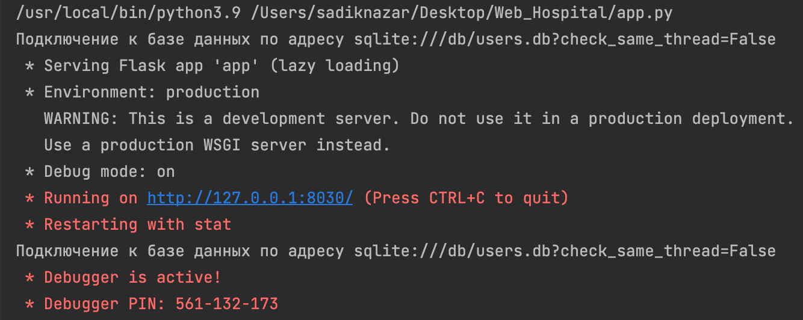
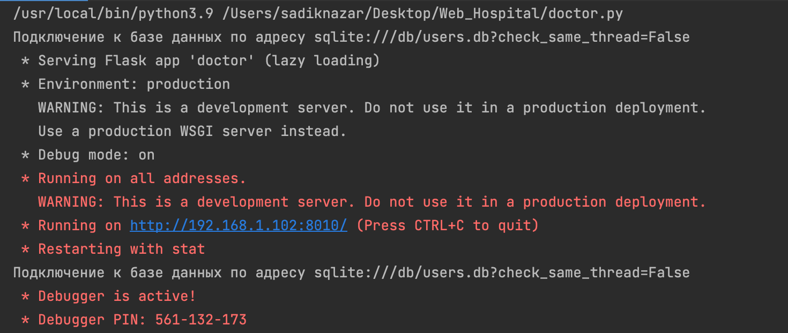

<h1>WEB-Проект "Поликлиника"</h1>

    В настоящее время очереди в больницах становятся не только источником бесцельной потери времени, затраченного на ожидание приёма врача в очереди, но и разносчиком различных заболеваний, что может повлечь за собой недопустимые для обычного визита в больницу последствия. Для этого мы разрабатываем WEB-приложение, которое позволит записываться к врачу из дома, отслеживая постоянно время приёма, если оно сдвинулось из-за стоящими перед вами пациентами.

<h2>Запуск проекта</h2>

    Для того что бы запустить проект, вам необходимо скачать архив или склонировать репозиторий. Далее вам требуется запустить файл app.py и парралельно с ним запустить doctor.py. Теперь у вас два запущенных приложения, для пациентов и системных администраторов, и для докторов соответсвенно.

<h3>Результат для app.py</h3>

<h3>Результат для doctor.py</h3>

<h2>Данные для входа в систему</h2>

<h3>Данных для системного администратора</h3>

    <em><strong>Логин:</strong></em>
    qwe@mail.com  
    <em><strong>Пароль:</strong></em>
    qwe  
    Системный адмнистратор такой же пациент, только с дополнительными функциями, поэтому на этом аккаунте можно работать и с функцимями пациента

<h3>Данных для доктора</h3>

    <em><strong>Логин:</strong></em>
    tester2  
    <em><strong>Пароль:</strong></em>
    tester2

